# System Architecture Diagram

## Full System Flow (Mermaid)

```mermaid
graph TB
    subgraph Discord["🎮 Discord Server"]
        Voice["Voice Channel<br/>(Audio RTP)"]
        Text["Text Channel<br/>(Slash Commands)"]
    end

    subgraph OpenClaw["🔮 OpenClaw Plugin"]
        Phase2["Phase 2:<br/>VoiceConnectionManager<br/>(Connection Lifecycle)"]
        Phase3In["Phase 3:<br/>AudioStreamHandler<br/>(Capture)<br/>• Jitter Buffer<br/>• Opus Decode<br/>• Circular Buffer"]
        Phase4["Phase 4:<br/>STT Pipeline<br/>(Speech → Text)<br/>• Audio Buffering<br/>• Whisper API Call"]
        Phase6["Phase 6:<br/>Voice Command<br/>• Parse Intent<br/>• Route to Agent<br/>• Aggregate Response"]
        Phase5["Phase 5:<br/>TTS Pipeline<br/>(Text → Speech)<br/>• ElevenLabs API<br/>• Audio Buffering"]
        Phase3Out["Phase 3:<br/>AudioStreamHandler<br/>(Playback)<br/>• Opus Encode<br/>• RTP Assembly"]
        Agent["🧠 Agent Layer<br/>(Rue)"]
    end

    subgraph External["☁️ External APIs"]
        Whisper["OpenAI Whisper<br/>(STT)<br/>$0.002/min"]
        Eleven["ElevenLabs TTS<br/>(Speech)<br/>$0.000003/char"]
        DiscordAPI["Discord API<br/>(Bot Control)"]
    end

    subgraph Storage["💾 Config"]
        EnvFile[".env File<br/>• DISCORD_BOT_TOKEN<br/>• OPENAI_API_KEY<br/>• ELEVENLABS_API_KEY"]
    end

    %% Voice Flow (Inbound)
    Voice -->|Opus (RTP)| Phase2
    Phase2 -->|Opus packets| Phase3In
    Phase3In -->|PCM Audio| Phase4
    Phase4 -->|HTTP POST| Whisper
    Whisper -->|Text| Phase4
    Phase4 -->|Transcript| Phase6
    Phase6 -->|Intent| Agent
    Agent -->|Response Text| Phase6

    %% Voice Flow (Outbound)
    Phase6 -->|Response| Phase5
    Phase5 -->|HTTP POST| Eleven
    Eleven -->|PCM Audio| Phase5
    Phase5 -->|PCM| Phase3Out
    Phase3Out -->|Opus (RTP)| Phase2
    Phase2 -->|Encrypted Audio| Voice

    %% Text Commands
    Text -->|Slash Command| Phase6
    Phase6 -->|Text Response| Text

    %% Configuration
    EnvFile -.->|Loaded at startup| Phase2
    EnvFile -.->|Used by| Phase4
    EnvFile -.->|Used by| Phase5

    %% API Auth
    Phase4 -.->|Authorization| Whisper
    Phase5 -.->|Authorization| Eleven
    Phase2 -.->|Authorization| DiscordAPI

    %% Styling
    classDef discord fill:#5865F2,stroke:#fff,color:#fff
    classDef openclaw fill:#7c3aed,stroke:#fff,color:#fff
    classDef api fill:#059669,stroke:#fff,color:#fff
    classDef config fill:#f59e0b,stroke:#fff,color:#000
    classDef agent fill:#ec4899,stroke:#fff,color:#fff

    class Discord discord
    class OpenClaw openclaw
    class External api
    class Storage config
    class Agent agent
```

## Sequence Diagram (User Speaks → Bot Responds)

```mermaid
sequenceDiagram
    participant User as Discord User
    participant Voice as Voice Channel
    participant Phase2 as VoiceConnectionManager
    participant Phase3 as AudioStreamHandler
    participant Phase4 as STT Pipeline
    participant Whisper as OpenAI Whisper
    participant Agent as Rue Agent
    participant Phase5 as TTS Pipeline
    participant Eleven as ElevenLabs
    participant Audio as AudioStreamHandler<br/>(Playback)

    User ->> Voice: Speaks in channel
    Voice ->> Phase2: RTP packets (encrypted, Opus)
    Phase2 ->> Phase3: VoiceConnection ready
    Phase3 ->> Phase3: Decrypt & decode Opus → PCM
    Phase3 ->> Phase4: PCM audio frames
    Phase4 ->> Phase4: Buffer 1-2 sec of audio
    Phase4 ->> Whisper: HTTP POST (PCM audio)
    Whisper ->> Phase4: Transcription (text)
    Phase4 ->> Agent: "User said: {transcript}"
    Agent ->> Agent: Process command
    Agent -->> Phase5: Response text
    Phase5 ->> Phase5: Format for speech
    Phase5 ->> Eleven: HTTP POST (text)
    Eleven ->> Phase5: PCM audio (nova voice)
    Phase5 ->> Audio: PCM audio frames
    Audio ->> Audio: Encode PCM → Opus
    Audio ->> Phase2: RTP packets
    Phase2 ->> Voice: Send encrypted Opus
    Voice ->> User: Bot speaks in channel
```



## Data Flow Diagram (Detailed)


## API Call Sequence (With Latency)


## Component Interaction Matrix


## Error Handling Flowchart

```mermaid
graph TD
    Start["User speaks<br/>in voice channel"]
    
    Start --> STT["STT Pipeline<br/>Call Whisper API"]
    
    STT -->|Success| Parse["Parse transcript"]
    STT -->|Whisper API<br/>Unavailable| STTFail["❌ STT Failed"]
    STT -->|Rate Limited| STTLimit["⏳ Rate Limited<br/>Wait & Retry"]
    
    STTFail --> TTSFail["Send response<br/>as text"]
    STTFail --> End1["User sees<br/>text in Discord"]
    
    STTLimit --> STT
    
    Parse --> Agent["Call Agent"]
    Agent -->|Success| Response["Agent Response"]
    Agent -->|Timeout >30s| Timeout["⏱️ Timeout"]
    
    Timeout --> TTSPartial["Send partial<br/>response"]
    
    Response --> TTS["TTS Pipeline<br/>Call ElevenLabs API"]
    TTSPartial --> TTS
    
    TTS -->|Success| Playback["Encode & Playback"]
    TTS -->|ElevenLabs<br/>Unavailable| TTSFail
    TTS -->|Rate Limited| TTSLimit["⏳ Rate Limited<br/>Wait & Retry"]
    
    TTSLimit --> TTS
    
    Playback --> Disconnect{"Voice Channel<br/>Still Active?"}
    
    Disconnect -->|Yes| Success["✓ Audio played"]
    Disconnect -->|No| DisconnectErr["⚠️ Disconnected<br/>During playback"]
    
    Success --> End2["User hears<br/>response"]
    DisconnectErr --> End3["Response<br/>discarded"]
    End1 --> Done["Done"]
    End2 --> Done
    End3 --> Done
    TTSFail --> End1
    
    style Start fill:#e3f2fd
    style Success fill:#c8e6c9
    style STTFail fill:#ffcdd2
    style TTSFail fill:#ffcdd2
    style Timeout fill:#ffe0b2
    style DisconnectErr fill:#ffe0b2
    style Done fill:#c8e6c9
```


